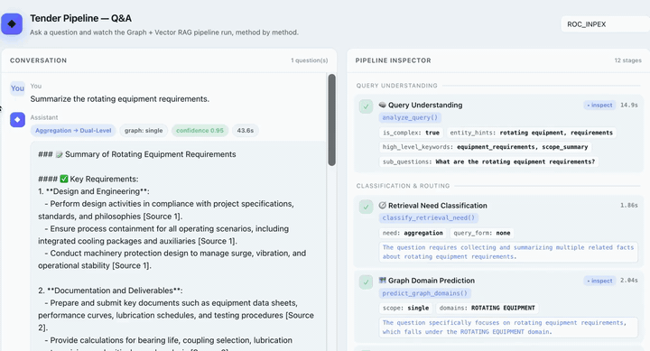
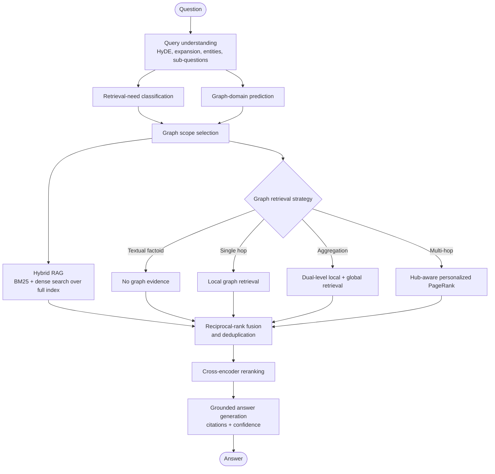
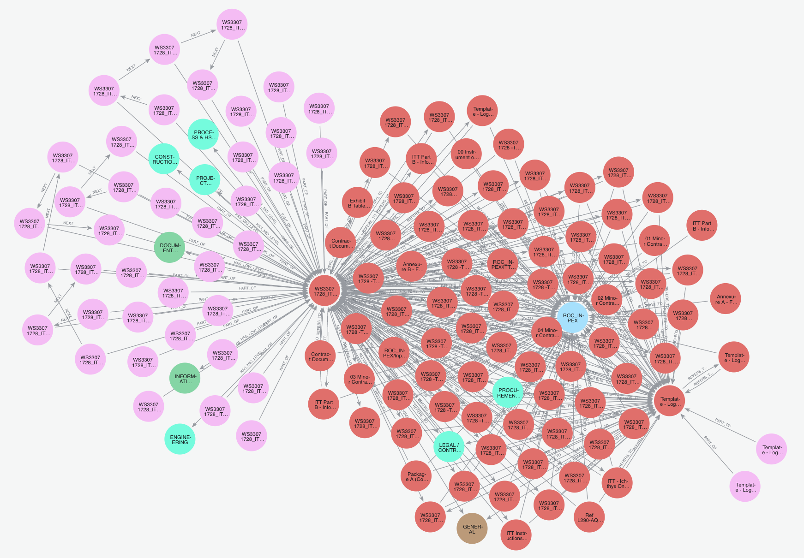
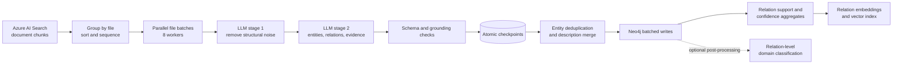

# Adaptive Graph + Vector RAG for Tender Intelligence

An evidence-grounded question-answering system for large tender and ITB corpora. The project combines Azure AI Search, a provenance-rich Neo4j knowledge graph, adaptive retrieval, cross-encoder reranking, and grounded answer generation behind a LangGraph workflow with live execution tracing.

The system is designed for questions that range from direct contractual fact lookup to aggregation and multi-hop relationship discovery across technical, commercial, and legal documents.

## Demo

<div align="center">
  <a href="./demo_gds_cut.mp4">
    
  </a>
</div>

The interface streams each reasoning and retrieval stage as it executes, including route selection, graph scope, retrieved evidence, fusion, reranking, references, confidence, and total latency.

## System overview

The repository contains two connected systems:

1. An offline knowledge-graph construction pipeline that transforms document chunks into entities, semantic relations, evidence edges, domain assignments, and vectorized relation representations.
2. An online LangGraph retrieval pipeline that selects the appropriate retrieval strategy for each question and combines graph evidence with full-index hybrid search.

| Layer | Technology | Responsibility |
|---|---|---|
| Orchestration | LangGraph | Typed state, parallel branches, synchronization, and deterministic execution |
| API | FastAPI + Server-Sent Events | Synchronous answers, live stage events, health checks |
| User interface | Next.js + React + TypeScript | Conversational UI and expandable pipeline trace |
| Text retrieval | Azure AI Search | BM25, semantic ranking, and dense-vector retrieval |
| Graph retrieval | Neo4j | Entity linking, local traversal, dual-level search, and personalized PageRank |
| Models | Azure OpenAI through APIM | Query analysis, routing, extraction, classification, and answer generation |
| Reranking | `BAAI/bge-reranker-large` | Cross-encoder ranking of the fused evidence pool |
| Evaluation | Pytest, RAGAS, synthetic QA, LLM-as-judge | Routing, retrieval, answer-quality, and regression experiments |

## Online LangGraph pipeline

The workflow is deliberately constrained rather than implemented as an open-ended agent loop. LangGraph controls execution, while each retrieval algorithm remains an independently testable function.



LangGraph runs the two classification nodes concurrently after query understanding. It then runs Hybrid RAG and the selected graph branch concurrently before joining them at reciprocal-rank fusion. A textual factoid follows the same synchronization contract but contributes an empty graph result.

### Adaptive retrieval policy

| Classified need | Graph strategy | Intended query shape |
|---|---|---|
| `textual_factoid` | None; Hybrid RAG only | A value or clause explicitly present in text |
| `single_hop` | Local graph neighborhood | One relationship such as `(subject, predicate, ?)` |
| `aggregation` | Dual-level local and global retrieval | Collecting or summarizing evidence across many relations |
| `multi_hop` | Hub-aware personalized PageRank | Discovering paths, dependencies, and indirect relationships |

Hybrid RAG always searches the complete Azure index. Domain prediction can narrow only the graph branch, preventing a routing error from suppressing text evidence. The current public entry point preserves the original API contract through [`orchestrator.py`](./chatbot/src/pipeline/orchestrator.py), while the graph definition and typed state live in [`langgraph_pipeline.py`](./chatbot/src/pipeline/langgraph_pipeline.py).

## Knowledge graph



The graph retains source provenance instead of storing only extracted triples. Its principal schema is:

```text
(ITB)<-[:BELONGS_TO]-(Document)<-[:PART_OF]-(Chunk)
                                      ├─[:MENTIONS]──────────────>(Entity)
                                      └─[:ASSERTS {evidence,...}]->(Relation)

(Entity)-[:SUBJECT_OF]->(Relation)-[:OBJECT_OF]->(Entity)
(Relation)-[:CLASSIFIED_AS]->(LowLevelDomain | MidLevelDomain)
```

Every `ASSERTS` edge carries evidence text, confidence, page number, document URL, filename, and relation strength. This makes answer citations traceable to the original tender clause and permits multiple chunks to support the same logical relation.

## Knowledge-graph construction pipeline

The offline pipeline reads document chunks from Azure AI Search, extracts a semantic layer with strict validation, checkpoints intermediate state, writes the graph to Neo4j, and creates relation embeddings for global graph retrieval.



Key engineering properties:

- Stable entity and relation identifiers based on normalized content hashes.
- A controlled 32-category entity taxonomy with a safe `other` fallback.
- Free-form relation labels that preserve tender-specific semantics.
- Prompt-level self-checks require every relation to cite an exact span from the cleaned chunk; the ingestion layer also validates required fields and bounds numeric confidence values.
- Thread-safe parallel extraction with atomic pickle checkpoints and failed-chunk retry.
- Batched, idempotent Neo4j writes using constraints and `MERGE`.
- Canonical entity-description synthesis across repeated mentions.
- Relation embeddings built from endpoints, keywords, and descriptions for Neo4j-native vector search.
- Three-tier engineering-domain taxonomy: high, mid, and low level.

The production CLI is in [`graph_construction/pipeline`](./graph_construction/pipeline); the exploratory notebooks are retained for reproducibility and investigation. A detailed schema and design discussion is available in [`chatbot/GRAPH_CONSTRUCTION.md`](./chatbot/GRAPH_CONSTRUCTION.md).


## Installation

Install [`uv`](https://docs.astral.sh/uv/) and Node.js 20+, then run the following commands from the repository root. `uv` manages the Python interpreter, virtual environment, dependency resolution, and package installation.

```bash
# Install a supported Python interpreter and create the environment.
uv python install 3.12

# Create the locked Python environment and install frontend dependencies.
uv sync

npm --prefix web/pipeline-ui ci
```

[`pyproject.toml`](./pyproject.toml) and `uv.lock` are the canonical Python dependency manifests used by local development and the backend container.

## Run locally

Start the backend in one terminal:

```bash
cd chatbot
uv run uvicorn pipeline_app:app \
  --host 0.0.0.0 \
  --port 7060 \
  --env-file ../.env \
  --reload
```

Start the frontend in another terminal:

```bash
cd web/pipeline-ui
PIPELINE_API_URL=http://localhost:7060 npm run dev
```

Open [http://localhost:3000](http://localhost:3000). API documentation is available at [http://localhost:7060/docs](http://localhost:7060/docs).

### Run with containers

The Compose stack builds the locked Python environment with `uv`, starts the backend on port `7060`, waits for its health check, and then starts the frontend on port `3000`:

```bash
docker compose up --build
```

## API

| Method | Endpoint | Description |
|---|---|---|
| `GET` | `/pipeline/health` | Liveness check |
| `POST` | `/pipeline/ask` | Execute the graph and return the final structured response |
| `POST` | `/pipeline/stream` | Stream stage and final events over SSE |

Synchronous request:

```bash
curl -sS http://localhost:7060/pipeline/ask \
  -H 'Content-Type: application/json' \
  -d '{"question":"What is the bid validity period?","tender_id":"ROC_INPEX"}'
```

Stream the execution trace:

```bash
curl -N http://localhost:7060/pipeline/stream \
  -H 'Content-Type: application/json' \
  -d '{"question":"How is Package A related to Baker Hughes?","tender_id":"ROC_INPEX"}'
```

The SSE contract emits `open`, `stage`, `final`, and `error` events. Stage events contain a stable identifier, group, status, elapsed time, compact details, and bounded inspection payloads for chunks, entities, relations, text, or JSON.

## Build the knowledge graph

The graph-construction job calls external model, search, and database services and can be expensive. Confirm the target ITB and credentials before starting it.

```bash
cd graph_construction

# Full extraction, Neo4j write, aggregation refresh, and relation embeddings
uv run python -m pipeline.run_pipeline --target-itb ROC_INPEX

# Resume only chunks recorded as failed in the checkpoint
uv run python -m pipeline.run_pipeline --retry-failed --target-itb ROC_INPEX

# Run extraction and checkpointing without writing to Neo4j
uv run python -m pipeline.run_pipeline \
  --target-itb ROC_INPEX \
  --skip-neo4j-write \
  --skip-embeddings
```

Relation-level domain classification is maintained separately in [`graph_construction/relation_classification.ipynb`](./graph_construction/relation_classification.ipynb).

## Tests and verification

Run backend tests from the repository root:

```bash
uv run pytest -q
```

Build the frontend with production type checking:

```bash
npm --prefix web/pipeline-ui run build
```

The LangGraph regression suite covers all four routes, domain-filter behavior, graph/text retrieval concurrency, stage-event compatibility, graph topology, and the final SSE contract. Tests replace external services with deterministic stubs, so they do not consume Azure or Neo4j resources.
